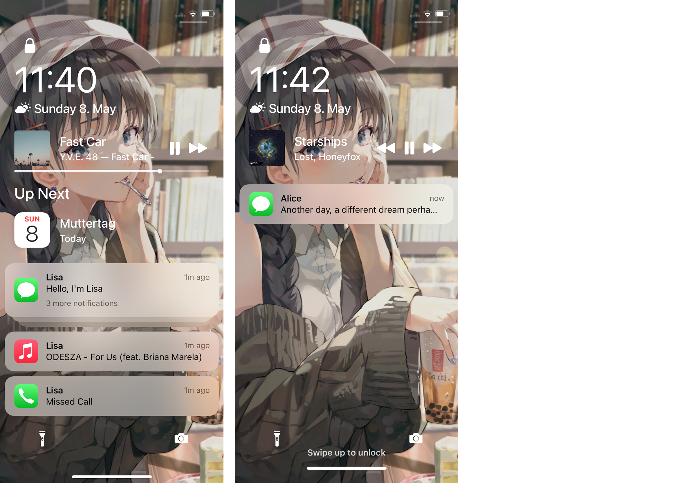

# PomPom 🍬
A tidy lock screen redesign

## Preview

## Installation
1. Add this repository to your package manager: `TBD`
2. Install PomPom

## Compatibility
iPhone, iPad and iPod running iOS/iPadOS 14.2 or later

## Compiling
  - [Theos](https://theos.dev/) is required to compile the project
  - Depends on [AppList](https://github.com/rpetrich/AppList)
  - You may want to edit the root `Makefile` to use your Theos SDK and toolchain

## License
[MIT](https://github.com/Traurige/PomPom/blob/main/LICENSE)

## Credits
  - Inspiration
    - [Ayden Panhuyzen](https://twitter.com/aydenpanhuyzen)
  - Icon And Banner
    - [74k1_](https://twitter.com/74k1_)
