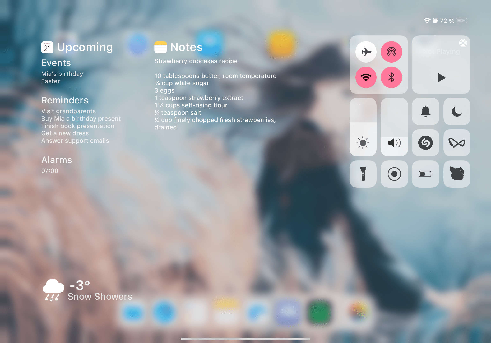

# Yuna 🍃
Upcoming events, notes and weather in your control center

## Preview

## Installation
1. Add this repository to your package manager: `TBD`
2. Install Yuna

## Compatibility
iPad running iPadOS 13 or later

## Compiling
  - [Theos](https://theos.dev/) is required to compile the project
  - Depends on [AppList](https://github.com/rpetrich/AppList) and [libGCUniversal](https://github.com/MrGcGamer/LibGcUniversalDocumentation)
  - You may want to edit the root `Makefile` to use your Theos SDK and toolchain

## License
[MIT](https://github.com/Traurige/Yuna/blob/main/LICENSE)

## Credits
  - Icon And Banner
    - [74k1_](https://twitter.com/74k1_)
  - Duo Twitter Cell
    - [arm64e](https://twitter.com/arm64e), [MrGcGamer](https://twitter.com/MrGcGamer)
